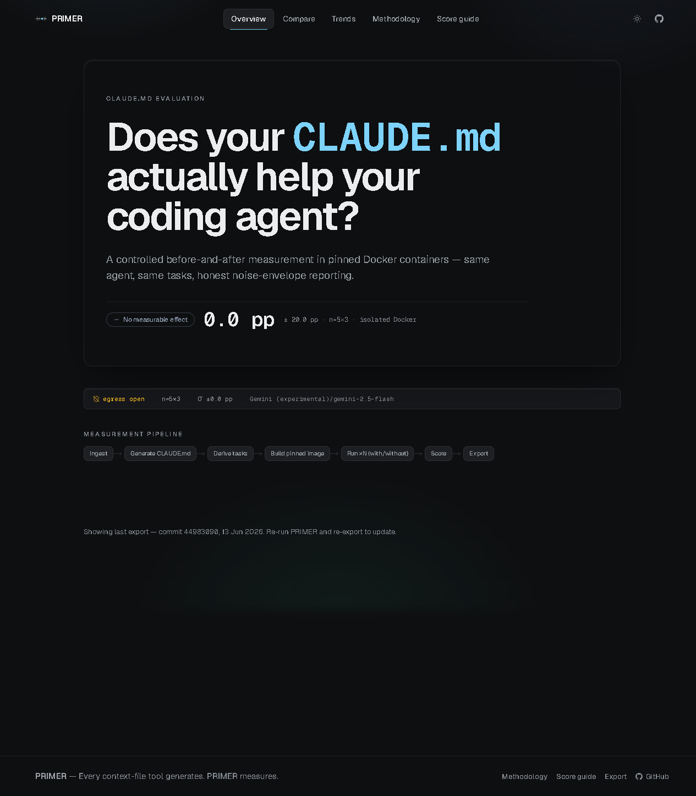
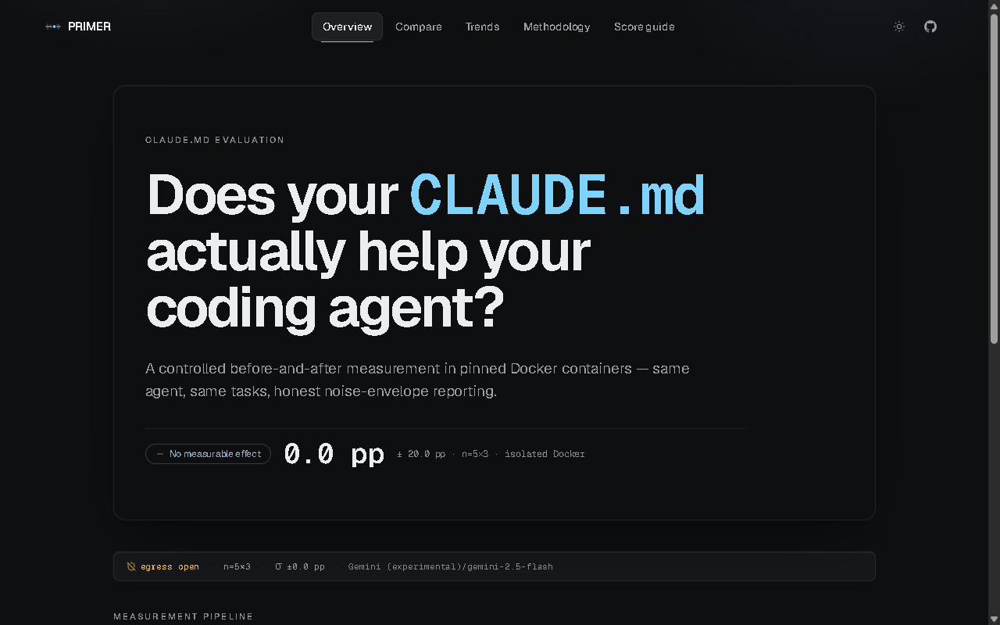
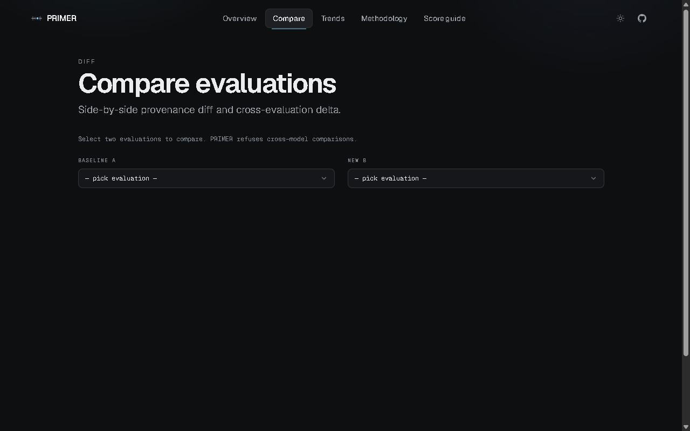
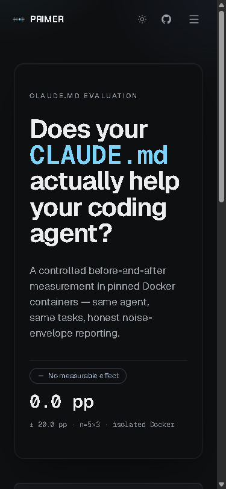

[](https://github.com/kanwa2006/primer/actions/workflows/pages.yml)
[](LICENSE)
[](https://kanwa2006.github.io/primer/)
[](pyproject.toml)

# PRIMER

> Every context-file tool generates. PRIMER measures.

**PRIMER is a measurement harness for AI coding agent context files.**

It answers one specific question: *does your `CLAUDE.md` (or `AGENTS.md`) actually improve your AI coding agent's performance on your repository — or does it hurt?*

PRIMER runs a controlled before/after experiment using real, deterministically-verifiable coding tasks inside hermetically isolated Docker containers. It reports a signed success-rate delta with a variance envelope.

**[Live dashboard →](https://kanwa2006.github.io/primer/)**

---

## How It Works

```
Your Repository
      │
      ▼
primer init       ← analyses git history + generates context file (Ollama / cloud)
      │
      ▼
primer eval       ← derives verifiable tasks from git history
      │
      ├──── Docker Container (WITHOUT context file)
      │         agent runs 5 tasks × 3 runs
      │
      └──── Docker Container (WITH context file)
                agent runs same 5 tasks × 3 runs
                      │
                      ▼
              success-rate Δ ± noise threshold
              cost Δ  ·  per-task flip table
              SQLite store  ·  scores.json badge
              static dashboard (GitHub Pages)
```

Each evaluation arm runs inside a hermetically isolated Docker container. Egress enforcement prevents the agent from calling external services during the run. The signed delta is written to SQLite and exported to JSON for the dashboard.

**Two task types** derived from your git history:
- `revert_reimplement` — revert a recent single-file commit, ask the agent to re-implement it; success = tests pass
- `stub_function` — stub a top-level function body, ask the agent to implement it; success = tests pass

Both are deterministic and pytest-verified. No LLM judge. No human grading. Task derivation currently targets **Python repositories only**.

---

## Provider Support

PRIMER has two distinct provider layers: **generation** (writing the context file) and **evaluation** (the agent that runs tasks inside Docker).

### Generation providers — `primer init`

| Provider | Status | Key required |
|----------|--------|-------------|
| Ollama (local) | ✅ Supported | No |
| Anthropic | ✅ Supported | `ANTHROPIC_API_KEY` |
| OpenAI | ✅ Supported | `OPENAI_API_KEY` |
| Gemini | ✅ Supported | `GEMINI_API_KEY` |
| OpenRouter | ✅ Supported | `OPENROUTER_API_KEY` |

Install optional provider SDKs:
```bash
pip install -e .[openai]           # OpenAI
pip install -e .[gemini]           # Gemini
pip install -e .[all-providers]    # OpenAI + Gemini
```

### Evaluation agents — `primer eval`

The eval agent runs **inside Docker** and requires its own API key injected into the container.

| Agent | Status | Key required |
|-------|--------|-------------|
| Claude Code (`claude_code`) | ✅ Default, stable | `ANTHROPIC_API_KEY` |
| Gemini CLI (`gemini`) | ⚠️ Experimental | `GEMINI_API_KEY` |

> **Note:** Evaluation requires an agent key regardless of which generation provider you use. The default agent is Claude Code; it always requires `ANTHROPIC_API_KEY`.

### What each provider writes

Both eval adapters currently write `CLAUDE.md` as the context filename (the file the agent reads from the working directory). Running `primer init` with any generation provider writes the file named after the configured eval agent — `CLAUDE.md` for Claude Code, `CLAUDE.md` for the Gemini adapter.

---

## Measurement Model

| Concept | Definition |
|---------|------------|
| **Delta (Δ)** | `success_rate_with − success_rate_without` (percentage points) |
| **Noise threshold** | `max(1/n_tasks, success_stddev)` — the minimum detectable signal |
| **Verdict** | One of four: **Helped ▲** / **Hurt ▼** / **No measurable effect ≈** / **Not comparable ⊘** |
| **Flip** | A task whose outcome changed between arms (PASS→FAIL, FAIL→PASS, etc.) |
| **Cost delta** | Separate stream: token cost WITH vs WITHOUT, tracked independently |

A within-noise result (`≈`) is a valid, honest outcome — it means the experiment cannot distinguish your context file from noise at this sample size.

---

## Screenshots

**Overview — latest verdict, evaluation ledger, pipeline status**


**Evaluation detail — confidence ruler, metrics grid, per-task flip table**


**Compare — two evaluations side by side**


**Mobile — responsive layout**


---

## Quick Start

### Prerequisites

| Requirement | For |
|-------------|-----|
| Python ≥ 3.10 | All commands |
| Docker (running) | `primer eval` |
| API key for your chosen eval agent | `primer eval` (Claude Code costs ~$0.01–$0.10 per run) |
| Ollama (optional) | `primer init` at $0 cost |

### Install

```bash
git clone https://github.com/kanwa2006/primer.git
cd primer
pip install -e .
cp .env.example .env
# Edit .env — set ANTHROPIC_API_KEY at minimum
```

For all generation providers:

```bash
pip install -e .[all-providers]   # adds openai + google-genai
```

### Run

```bash
# Step 1: generate a context file for your repo (~$0 with Ollama)
primer init /path/to/your/repo

# Step 2: run the before/after evaluation
primer eval /path/to/your/repo

# Step 3: view the result
primer report /path/to/your/repo
```

### Example output

```
PRIMER eval → /path/to/your/repo

1/5  Analysing repo ...
     Commit abc1234 | langs ['python']
2/5  Generating CLAUDE.md ...
     Generated 48 lines  (overhead: ~$0.004)
3/5  Deriving tasks ...
     5 validated tasks ready
4/5  Building eval image ...
     Image: primer-eval:abc1234
5/5  Running 5 tasks × {without, with} × 3 runs (sequential) ...

  Delta      +12.0 pp ± 15.0 pp noise threshold
  Verdict    ≈ No measurable effect
  WITHOUT    53.3%   WITH    65.3%
  Tasks      5       Runs    3
```

### Export and publish

```bash
primer export /path/to/your/repo --site-output dashboard/public

# Add the badge to your repo's README:
# []
```

---

## CLI Reference

| Command | Description |
|---------|-------------|
| `primer init <path>` | Analyse repo and generate context file |
| `primer eval <path>` | Run before/after evaluation |
| `primer report <path>` | Render latest score (text or `--json`) |
| `primer history <path>` | List all past evaluations |
| `primer compare <id1> <id2>` | Diff two evaluations side-by-side |
| `primer export <path>` | Write `scores.json` + dashboard JSON tree |

---

## Scope and Limitations

**What PRIMER does today:**
- ✓ Generates context files via Ollama (free), Anthropic, OpenAI, Gemini, or OpenRouter
- ✓ Derives coding tasks from git history automatically (Python repositories)
- ✓ Runs controlled before/after evaluation in Docker
- ✓ Reports signed delta with noise threshold
- ✓ Exports static dashboard to GitHub Pages
- ✓ Multi-evaluation history and cross-run comparison

**What PRIMER does not do today:**
- ✗ Non-Python repositories (task derivation targets Python only; tree-sitter is used for repo analysis)
- ✗ Evaluation without Docker (Docker is required for isolation)
- ✗ Evaluation without an API key for the eval agent
- ✗ Real-time evaluation (runs are sequential; 5 tasks × 3 runs takes ~15–45 minutes)
- ✗ Multiple eval agents in the same run (one agent per `primer eval` invocation)

**Current eval agent support:** Claude Code is the default and most tested. The Gemini CLI adapter is experimental — it was used for the live dashboard evaluations with egress open (`egress_enforced: false`); all results are within-noise (0.0 pp ± 20 pp).

---

## Repository Structure

```
primer/
├── primer/               # Python package — CLI + evaluation engine
│   ├── cli.py            # Composition root: init, eval, report, history, compare, export
│   ├── config.py         # Pydantic settings; single source of config truth
│   ├── eval/             # Eval harness: Docker runner, scorer, task derivation, adapters
│   ├── generate/         # Context file writer
│   ├── ingest/           # Repo analyser (tree-sitter, git log)
│   ├── llm/              # Provider factory + adapters (Anthropic, OpenAI, Gemini, Ollama, OpenRouter)
│   ├── report/           # Render + export (text, JSON, scores.json, dashboard JSON)
│   └── store/            # SQLite persistence
├── dashboard/            # Next.js 15 static dashboard → GitHub Pages
│   ├── app/              # 7 routes: /, /evaluations/[id], /compare, /trends, /methodology, /score-guide, /export
│   ├── components/       # VerdictHero, MetricsGrid, EvaluationLedger, ComparePanel, TrendsView, …
│   └── lib/              # format.ts, verdict.ts, computeComparison.ts
├── tests/                # 20 test files, 554 tests
├── docs/
│   └── assets/           # Screenshots for README
├── docker/               # Eval container Dockerfile + egress proxy
├── .github/
│   ├── workflows/pages.yml        # CI/CD — builds and deploys dashboard
│   ├── ISSUE_TEMPLATE/            # Bug report and feature request templates
│   └── pull_request_template.md
├── pyproject.toml        # Package metadata + pytest config
└── .env.example          # Config template — copy to .env and fill in keys
```

---

## Engineering Quality

### Test suite

**Python — 554 tests across 20 files:**

```bash
pip install -e .[dev]
pytest tests/ -v
# 550 pass, 4 skipped (Docker / live-API integration — set PRIMER_RUN_DOCKER_TESTS=1 to run)
```

**Dashboard — 11 TypeScript tests:**

```bash
cd dashboard && npm test
# 11/11 pass — covers computeComparison parity with Python engine
```

### CI / CD

Push to `main` → GitHub Actions builds the Next.js static export → deploys to GitHub Pages. No manual steps.

### Security

- API keys stored as `SecretStr` (pydantic-settings) — never appear in logs, `repr`, or exports
- `detect-secrets` baseline active; `.pre-commit-config.yaml` runs on every commit
- `primer export` output contains only metrics — no keys, tokens, or internal paths

---

## Research Basis

ETH Zurich SRI Lab + LogicStar.ai ([arXiv:2602.11988](https://arxiv.org/abs/2602.11988), Feb 2026) found that LLM-auto-generated context files **reduce** agent task success in 5 of 8 settings while **raising inference cost >20%**. Developer-written files average +4 pp. The paper demonstrates the need for systematic measurement — PRIMER runs that measurement automatically on your repo.

---

## Contributing

See [CONTRIBUTING.md](CONTRIBUTING.md) for setup instructions, development workflow, and architecture invariants.

---

## License

MIT — see [LICENSE](LICENSE).
