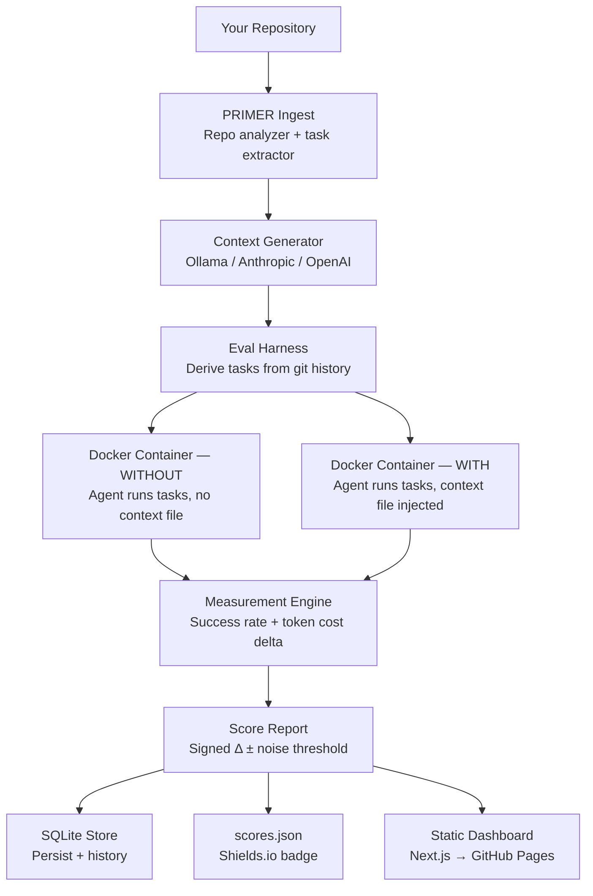

[](https://github.com/kanwa2006/primer/actions/workflows/pages.yml)
[](LICENSE)
[](https://kanwa2006.github.io/primer/)

# PRIMER

> Every context-file tool generates. PRIMER measures.

PRIMER is a **measurement harness** for AI coding agent context files (e.g. `CLAUDE.md`, `AGENTS.md`).
It runs real, verifiable tasks through the same agent **with and without** your context file — in isolated
Docker containers — and reports a trustworthy signed before/after success and token-cost delta **with variance**.

The delta may be positive, ~0, or negative. PRIMER is designed to *measure*, not to prove it helps.

---

## The Problem

AI coding agents are guided by context files you write or auto-generate. These files are unverified claims.
No tool exists to answer the question: **does mine actually help?**

Without measurement:
- You can't distinguish a helpful context file from a harmful one
- Auto-generated files often hurt (see [Evidence](#evidence))
- You ship unverified instructions into every agent session

PRIMER answers the question with evidence, not optimism.

---

## Why PRIMER Exists

ETH Zurich SRI Lab + LogicStar.ai ([arXiv:2602.11988](https://arxiv.org/abs/2602.11988), 12 Feb 2026) found that
LLM-auto-generated context files **reduce** agent task success in 5 of 8 settings while **raising inference cost >20%**.
Developer-written files can help (+4% avg). PRIMER measures which yours is.

The core insight: measuring context file effectiveness requires a controlled experiment, not a vibe check.
PRIMER runs that experiment automatically, on your actual repo, with your actual agent.

A within-noise or negative result is a valid, shippable outcome — it tells you something true.
Most tools are designed to always show improvement. PRIMER is designed to tell the truth.

---

## Key Differentiators

| Feature | PRIMER | Alternatives |
|---------|--------|-------------|
| Before/after controlled design | ✓ | ✗ (single-pass) |
| Docker isolation per run | ✓ | ✗ |
| Egress enforcement | ✓ | ✗ |
| Variance-aware reporting (σ beside Δ) | ✓ | ✗ |
| Honest negative / within-noise results | ✓ | ✗ |
| Multi-provider (Anthropic, OpenAI, Gemini, Ollama) | ✓ | Partial |
| Static dashboard, zero infrastructure | ✓ | ✗ |
| Longitudinal comparison across runs | ✓ | ✗ |

---

## Architecture



The harness runs two identical sets of tasks in hermetically isolated Docker containers — one without the
context file (baseline), one with (treatment). Each container has egress enforcement to prevent agent calls
escaping to external services. The signed delta, noise envelope, and per-task flip table are written to a
SQLite store and exported as JSON for the static dashboard.

---

## Features

- **`primer init`** — Analyse your repo and generate a lean context file via Ollama (free) or a cloud provider
- **`primer eval`** — Run the full before/after Docker evaluation harness
- **`primer report`** — Render the latest score report (text or JSON)
- **`primer history`** — List all past evaluations with delta and provider
- **`primer compare`** — Diff two past evaluations side-by-side (refuses cross-model comparisons)
- **`primer export`** — Export `scores.json` badge payload and full dashboard JSON tree
- **Variance-aware output** — Every delta ships with a noise threshold; within-noise results are reported, not hidden
- **WCAG AA dashboard** — Static Next.js dashboard with accessible tables, focus rings, reduced-motion support
- **Multi-provider** — Anthropic, OpenAI, Gemini, OpenRouter, Ollama (local, $0)

---

## Quick Start

### Prerequisites

- Python ≥ 3.10
- Docker (running)
- Anthropic API key (for `primer eval`; see [Scope](#scope))

### Install

```bash
git clone https://github.com/kanwa2006/primer.git
cd primer
pip install -e .
cp .env.example .env
# Edit .env — set ANTHROPIC_API_KEY at minimum
```

### First run

```bash
primer init .        # analyse repo, generate context file (~$0 with Ollama)
primer eval .        # run before/after evaluation (requires API key, costs money)
primer report .      # display the signed delta
```

### Expected output

```
PRIMER eval → /path/to/your/repo

1/5  Analysing repo ...
     Commit abc1234 | langs ['python']
2/5  Generating CLAUDE.md ...
     Generated 48 lines  (overhead: ~$0.004)
3/5  Deriving tasks ...
     5 validated tasks ready
4/5  Building eval image ...
     Image: primer-eval:abc1234
5/5  Running 5 tasks × {without, with} × 3 runs (sequential) ...

  Delta      +12.0 pp ± 15.0 pp noise threshold
  Verdict    ▲ Helped
  WITHOUT    53.3%   WITH    65.3%
  Tasks      5       Runs    3
```

---

## Scope

- **$0 file generation** via local Ollama (no API key needed for `primer init`)
- **Evaluation requires a Claude Code agent + Anthropic API key** and costs money
- Reports a signed Δ that may be ≤0; a within-noise result is a valid, shippable outcome

---

## Example Workflow

**Input:** A Python repo with 50+ commits and an existing `CLAUDE.md`

**What PRIMER does:**
1. Scans git history for tasks that can be automatically verified (test-passing commits, reversible file operations)
2. Generates a Docker image with your repo pinned at a specific commit
3. Runs 5 tasks × 3 repetitions without the context file (baseline)
4. Injects the context file and re-runs the same 5 tasks × 3 repetitions
5. Computes success rate delta with standard deviation
6. Flags individual tasks that flipped outcome (FAIL→PASS, PASS→FAIL), or were flaky

**Output:**
- Signed delta (e.g. `+12.0 pp ± 15.0 pp`) in the terminal
- `scores.json` for the shields.io badge
- `repository.json` + `evaluations/1.json` for the static dashboard
- SQLite record for future `primer compare` runs

---

## Screenshots

Screenshots pending — see [`docs/screenshot-plan.md`](docs/screenshot-plan.md) for the capture plan.

The live dashboard is at **[kanwa2006.github.io/primer](https://kanwa2006.github.io/primer/)**.

---

## Documentation

| Document | Description |
|----------|-------------|
| [docs/v3/README.md](docs/v3/README.md) | V3 planning artifact index and authority order |
| [docs/v3/PRIMER_V3_Product_Experience_Specification.md](docs/v3/PRIMER_V3_Product_Experience_Specification.md) | Source-of-truth product specification |
| [docs/v3/PRIMER_V3_Implementation_Architecture.md](docs/v3/PRIMER_V3_Implementation_Architecture.md) | Architecture decisions and module boundaries |
| [docs/v3/PRIMER_V3_Cleanup_Execution_Specification.md](docs/v3/PRIMER_V3_Cleanup_Execution_Specification.md) | V3 cleanup phases C0–C4 |
| [PRIMER_V3_FINAL_ACCEPTANCE_AUDIT.md](PRIMER_V3_FINAL_ACCEPTANCE_AUDIT.md) | End-to-end verification: build, tests, runtime, accessibility |
| [CONTRIBUTING.md](CONTRIBUTING.md) | Setup guide and contribution workflow |

---

## Engineering Quality

### Test Suite

**Python engine — 554 tests across 20 test files:**

```bash
pip install -e .[dev]
pytest tests/ -v
```

Coverage includes: config validation, repo ingest, context generation, task derivation, Docker runner
isolation, eval scoring, report rendering, site export, and CLI smoke tests. 550/554 pass; 4 skipped
(Docker/live-API integration tests requiring `PRIMER_RUN_DOCKER_TESTS=1`); 0 failures.

**Dashboard — 11 TypeScript tests:**

```bash
cd dashboard && npm test
```

Covers `computeComparison` parity logic (all 11 pass).

### CI Pipeline

The [GitHub Actions workflow](.github/workflows/pages.yml) on push to `main`:
1. Installs Node.js 20 with npm cache
2. Runs `npm ci` + `npm run build` in `dashboard/`
3. Generates the full static export (6 routes)
4. Copies `scores.json` into the output
5. Deploys to GitHub Pages via `actions/deploy-pages@v4`

### Security

- `.pre-commit-config.yaml` — pre-commit hooks active
- `detect-secrets` — secret scanning baseline at `.secrets.baseline`
- `.gitleaksignore` — gitleaks suppression for known false positives
- API keys stored as `SecretStr` via pydantic-settings — never appear in logs or repr

---

## Repository Structure

```
primer/
├── primer/               # Python package — CLI + evaluation engine
│   ├── cli.py            # Composition root: init, eval, report, history, compare, export
│   ├── config.py         # Pydantic settings; single source of config truth
│   ├── eval/             # Eval harness: Docker runner, scorer, task derivation, adapters
│   ├── generate/         # Context file writer
│   ├── ingest/           # Repo analyzer (tree-sitter, git log)
│   ├── llm/              # Provider factory + adapters (Anthropic, OpenAI, Gemini, Ollama)
│   ├── report/           # Render + export (text, JSON, scores.json, dashboard JSON)
│   └── store/            # SQLite persistence
├── dashboard/            # Next.js 15 static dashboard (GitHub Pages)
│   ├── app/              # Routes: /, /evaluations/[id], /compare
│   ├── components/       # VerdictHero, MetricsGrid, EvaluationLedger, ComparePanel, …
│   ├── lib/              # format.ts, basePath.ts, computeComparison.ts
│   └── public/           # repository.json + evaluations/*.json (generated by primer export)
├── tests/                # 20 test files, 554 tests
├── docs/                 # V3 planning specs + screenshot plan
│   └── v3/               # Product spec, architecture, cleanup spec, readiness audit
├── docker/               # Dockerfile + egress proxy for eval containers
├── .github/workflows/    # pages.yml — CI/CD to GitHub Pages
├── pyproject.toml        # Package metadata, dependencies, pytest config
├── .env.example          # Configuration template
└── PRIMER_V3_FINAL_ACCEPTANCE_AUDIT.md  # End-to-end verification record
```

---

## Evidence

| Document | What it proves |
|----------|---------------|
| [PRIMER_V3_FINAL_ACCEPTANCE_AUDIT.md](PRIMER_V3_FINAL_ACCEPTANCE_AUDIT.md) | Build clean, 550/554 tests pass (4 skipped: Docker integration), WCAG AA, all §17 gate items pass |
| [docs/v3/PRIMER_V3_Product_Experience_Specification.md](docs/v3/PRIMER_V3_Product_Experience_Specification.md) | Honesty invariants, design debt rejection register (§2b), motion spec |
| [docs/v3/PRIMER_V3_Implementation_Architecture.md](docs/v3/PRIMER_V3_Implementation_Architecture.md) | Module boundary decisions, frozen core rationale |
| [arXiv:2602.11988](https://arxiv.org/abs/2602.11988) | Academic basis for the measurement problem PRIMER solves |

---

## Roadmap

- [ ] Run `primer eval` against PRIMER itself — close the loop on the badge showing a real delta
- [ ] Add `aria-label="Per-task flip results"` to `TaskFlipTable` (accessibility polish)
- [ ] Commit `docs/authority/` — make V1/V2 governance documents tracked
- [ ] Social preview image — 1280×640px showing verdict hero + badge
- [ ] ESLint v9 config migration (`eslint.config.js`)

---

## Status

Phases 0–7 implemented. Run `primer eval .` to measure your context file.

---

## License

MIT, 2026, kanwa2006 — see [LICENSE](LICENSE).
